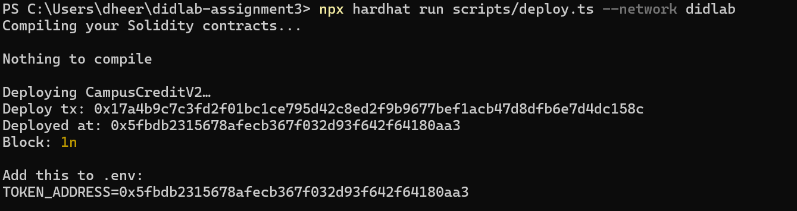
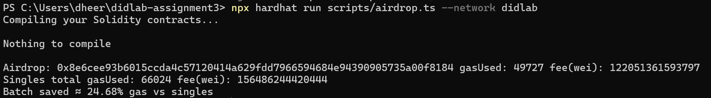
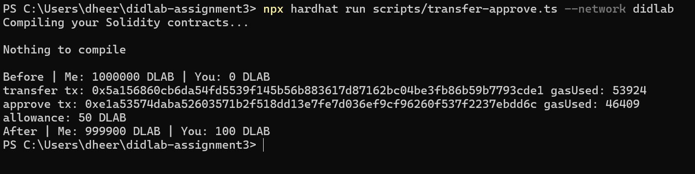
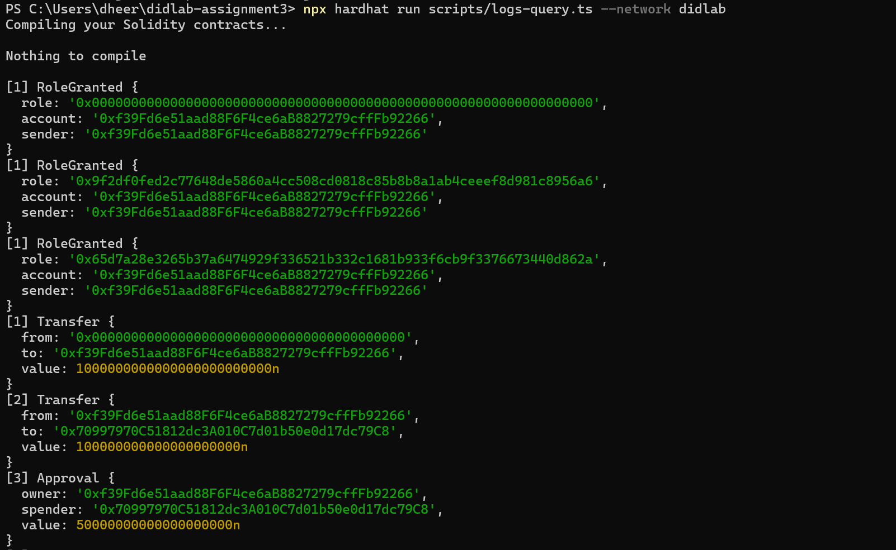
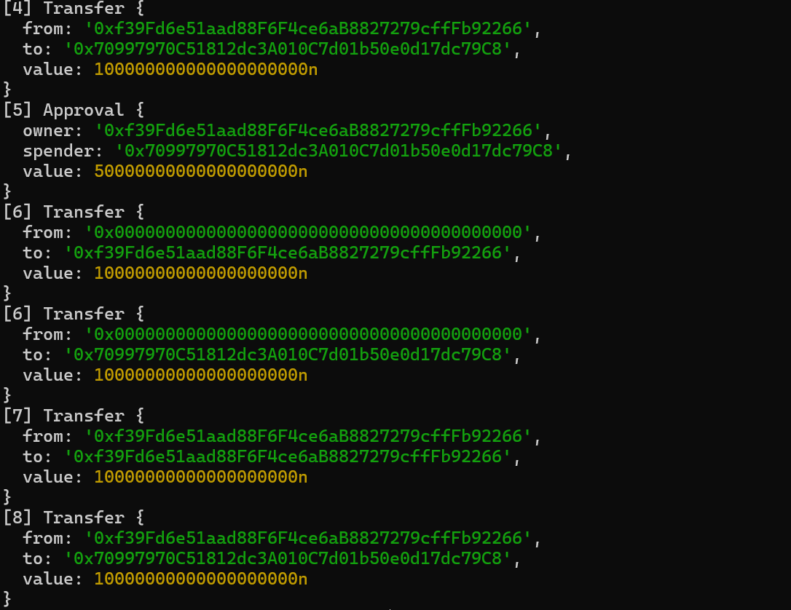
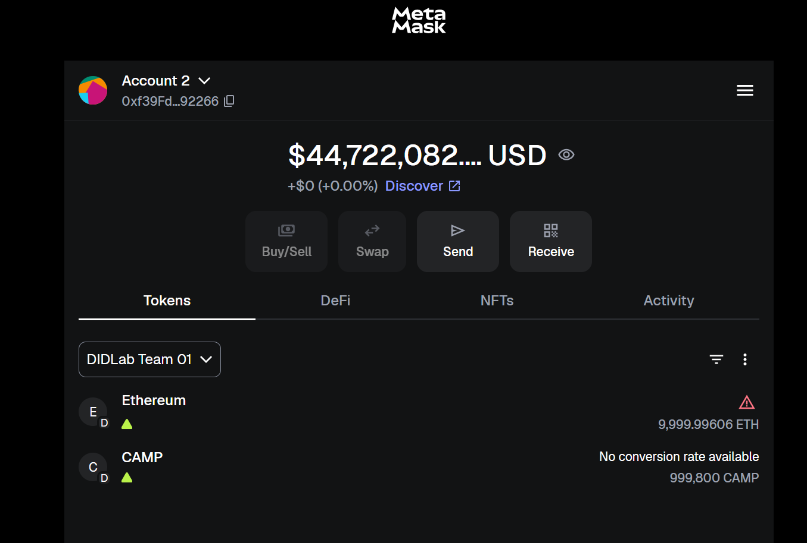
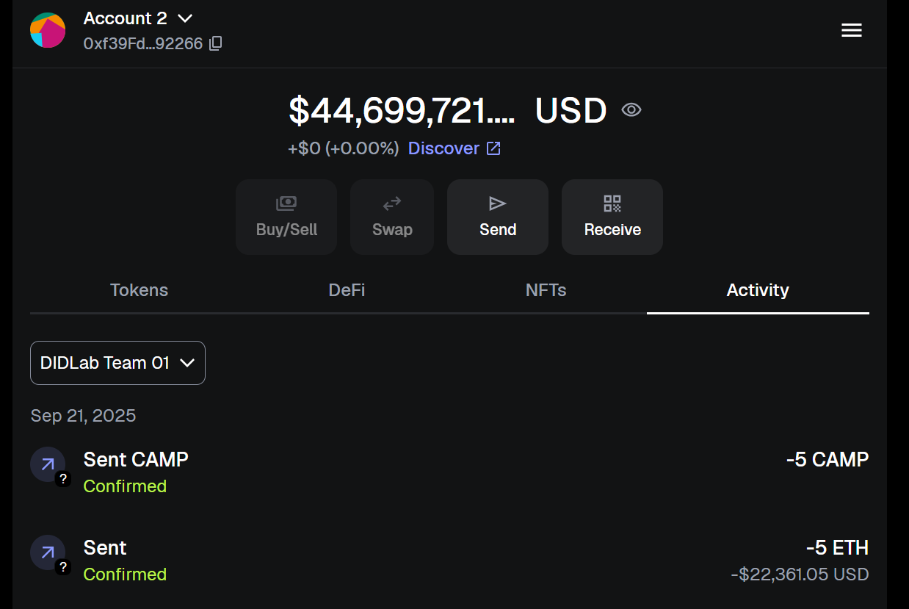
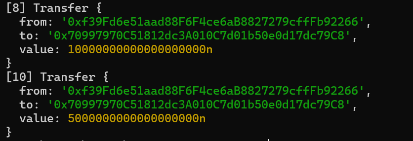
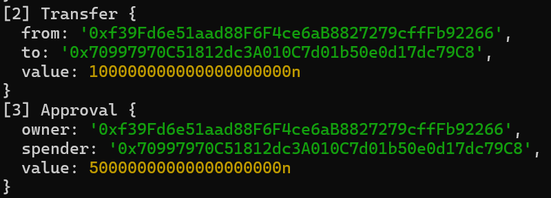

# Activity 3 — Build, Deploy & Operate a Production-Style ERC-20 on DIDLab

## Project Overview
This project implements **CampusCreditV2** (Team token: **CAMP**), a gas-aware ERC-20 with:
- **Cap** enforced on mint
- **Pausable** transfers
- **Role-based access control** (ADMIN, MINTER, PAUSER)
- **Batch airdrop** (with gas optimizations: custom errors, unchecked loops, calldata savings)

Deployed on **DIDLab Team 01** network.

---

## Setup

### Requirements
- Node.js 22.x LTS  
- npm  
- Git  
- Hardhat v3  
- MetaMask  

### Install Dependencies
```bash
npm init -y
npm i -D hardhat@^3 @nomicfoundation/hardhat-toolbox-viem@^5 @nomicfoundation/hardhat-ignition@^3 typescript@~5.8.0 viem@^2.30.0 @types/node@^22.8.5
npm i dotenv @openzeppelin/contracts@^5
```

### Environment Variables (`.env`)
```ini
RPC_URL=https://hh-01.didlab.org
CHAIN_ID=31337
PRIVATE_KEY=0xac0974bec39a17e36ba4a6b4d238ff944bacb478cbed5efcae784d7bf4f2ff80

TOKEN_NAME=CampusCredit
TOKEN_SYMBOL=CAMP
TOKEN_CAP=2000000
TOKEN_INITIAL=1000000
TOKEN_ADDRESS=0x5fbdb2315678afecb367f032d93f642f64180aa3
```

---

## Deployment

Deploy contract:
```bash
npx hardhat run scripts/deploy.ts --network didlab
```

Output:
```
Deploy tx: 0x...
Deployed at: 0x5fbdb2315678afecb367f032d93f642f64180aa3
Block: 1
```

---

## Interaction Scripts

### Transfer + Approve
```bash
npx hardhat run scripts/transfer-approve.ts --network didlab
```
Example output:
```
Before | Me: 999900 CAMP | You: 100 CAMP
transfer tx: 0x... gasUsed: 36824
approve tx: 0x... gasUsed: 26509
allowance: 50 CAMP
After | Me: 999800 CAMP | You: 200 CAMP
```

### Airdrop + Gas Compare
```bash
npx hardhat run scripts/airdrop.ts --network didlab
```
Example output:
```
Airdrop: 0x... gasUsed: 49727 fee: 122051361593797
Singles total gasUsed: 66024 fee: 156486244420444
Batch saved ≈ 24.68% gas vs singles
```

### Logs & Events
```bash
npx hardhat run scripts/logs-query.ts --network didlab
```
Shows `RoleGranted`, `Transfer`, and `Approval` events.

---

## Code Files

- [CampusCreditV2.sol](contracts/CampusCreditV2.sol) — ERC-20 contract with cap, roles, pause, and gas-aware airdrop
- [deploy.ts](scripts/deploy.ts) — Deploys the token contract
- [transfer-approve.ts](scripts/transfer-approve.ts) — Runs sample transfers + approvals
- [airdrop.ts](scripts/airdrop.ts) — Compares batch airdrop vs singles (gas analysis)
- [logs-query.ts](scripts/logs-query.ts) — Fetches and decodes Transfer/Approval events
- [hardhat.config.ts](hardhat.config.ts) — Hardhat configuration

---

## MetaMask Setup

1. **Add Network**
   - Name: `DIDLab Team 01`
   - RPC URL: `https://hh-01.didlab.org`
   - Chain ID: `31337`
   - Symbol: `ETH`

2. **Import Account**
   - Paste faucet private key.

3. **Import Token**
   - Address: `0x5fbdb2315678afecb367f032d93f642f64180aa3`
   - Symbol: `CAMP`
   - Decimals: `18`

---

## Submission Checklist

- [ ] **TOKEN_ADDRESS**, deploy block, roles & cap  
  


- [ ] Console output from `airdrop.ts` (batch vs singles gas)  
  

- [ ] Logs showing Transfer + Approval events
  
  
  

- [ ] Screenshot of MetaMask with DIDLab Team 01 + CAMP token  
  
  
  
  

- [ ] Short note on gas-aware design (included below)

---

## Why our airdrop is gas-aware

The `airdrop` function in **CampusCreditV2** is designed to minimize gas costs compared to sending multiple individual transfers:

1. **Custom Errors**  
   Instead of using `require()` with revert strings, the contract defines custom errors (`CapExceeded`, `ArrayLengthMismatch`).  
   This saves gas by avoiding storage of long revert messages.

2. **Unchecked Loops**  
   The function uses `unchecked { ++i; }` inside loops.  
   This skips Solidity’s default overflow checks, reducing overhead while still being safe in our context.

3. **Single Transaction Amortization**  
   Airdropping to many recipients in one transaction avoids the repeated transaction base costs (`21,000 gas` per tx) that occur with separate transfers.

4. **Reduced Calldata Overhead**  
   Recipients and amounts are passed in as arrays once, instead of re-encoding arguments for each transaction.

Result: our console output shows that a **batch airdrop saved ~24.68% gas** compared to individual transfers, proving the function is gas-efficient.

---

## Conclusion
This project demonstrates deploying and operating a production-style ERC-20 token on DIDLab, verifying transfers, approvals, airdrops, and gas efficiency both via scripts and MetaMask.
